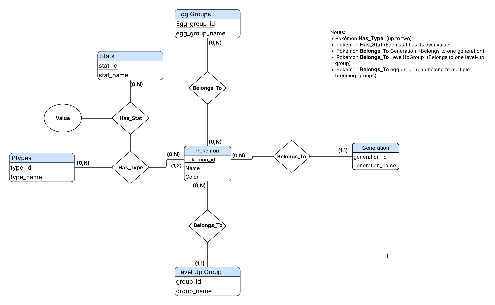
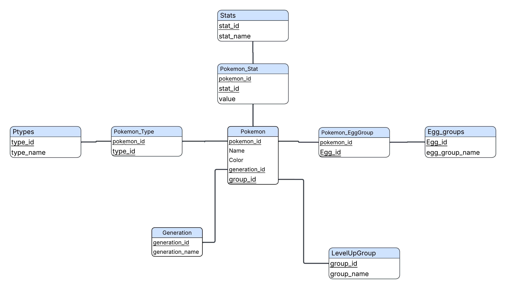

# Pokémon Relational Database

## Overview
This project is a relational database designed to organize and analyze Pokémon data using SQL. The database combines information about Pokémon types, base stats, generations, egg groups, colors, and level-up groups into a normalized relational structure.

The goal of the project was to design a database that could efficiently answer questions about Pokémon by combining information stored across multiple related tables.

## Tools & Technologies
- SQL
- MySQL
- Relational Database Design
- ER Modeling
- Data Cleaning and Transformation

## Database Design
The database was designed using primary keys, foreign keys, lookup tables, and bridge tables to create relationships between Pokémon and their attributes.

Some of the main tables include:

- `Pokemon`
- `ptypes`
- `Stat`
- `Generation`
- `LevelUpGroup`
- `egg_groups`

Bridge tables were used to handle many-to-many relationships, including:

- `Pokemon_Type`
- `Pokemon_Stat`
- `Pokemon_EggGroup`

## ER Diagram

## Relational Diagram

## Data Preparation
Data from multiple Pokémon data sources was imported and transformed before being added to the final database.

Staging tables were used to clean and organize the raw data before inserting it into the normalized database structure.

## SQL Analysis
The database supports queries involving:

- Multi-table joins
- Filtering and sorting
- Aggregate functions
- `GROUP BY`
- Comparing Pokémon statistics
- Searching by type, generation, egg group, and color
- Calculating total base statistics
- Identifying Pokémon with the highest or lowest individual stats
- Comparing Pokémon that meet multiple conditions

## Example Questions
Some of the questions explored with the database include:

- Which Pokémon have the highest Attack or Defense?
- Which Pokémon belong to a specific generation or egg group?
- Which Pokémon have multiple types?
- Which Pokémon have the highest total base stats?
- How do Pokémon statistics compare across different groups?
- Which Pokémon meet multiple type, stat, generation, or color conditions?

## Project Files
- `Pokemon_database.sql` — Database schema, data preparation, and SQL queries
- `Pokémon_ER_Diagram.png` — Entity Relationship Diagram
- `Pokedex_relational_diagram.png` — Relational database diagram
- `Final_Project_Report.pdf` — Full project report and analysis

## Data Sources
Data for this project was collected from publicly available Pokémon resources, including Pokémon Database, Serebii, and PokéAPI.

## Author
**Othmane Kerfal**

Computational and Data Sciences  
George Mason University
